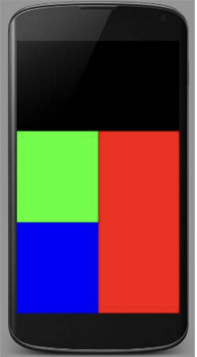
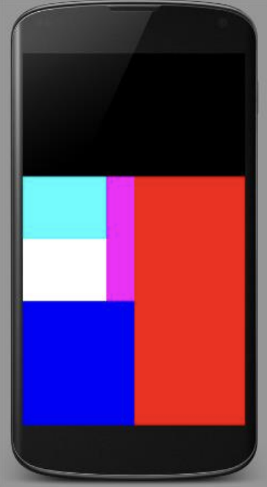
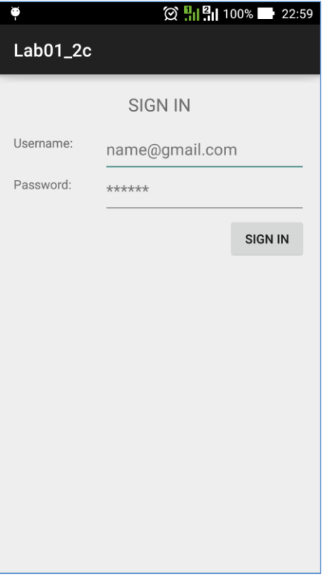
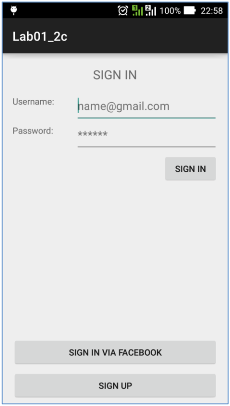

## Lab 1: CÁC LAYOUT CƠ BẢN
### Bài 1: LinearLayout

    
    

### Bài 2: RelativeLayout

    
    

### Bài 3: ContraintLayout
>Kết quả tương tự bài 2 nhưng dùng Contrain Layout

## Lab 2: LISTVIEW và RECYCLERVIER

